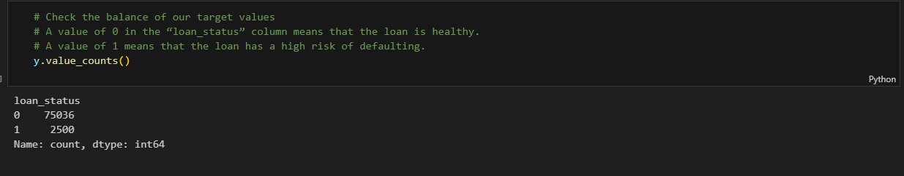
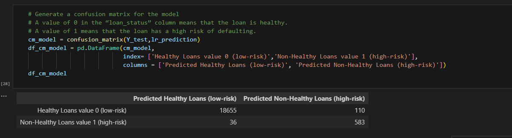
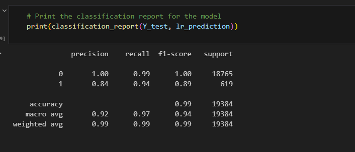
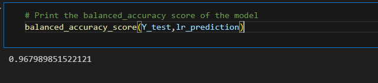
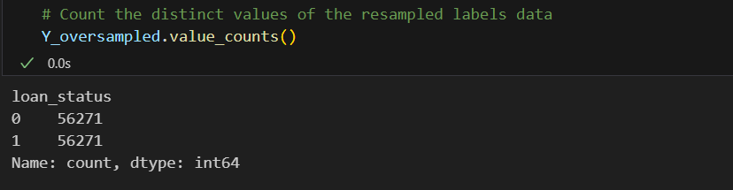
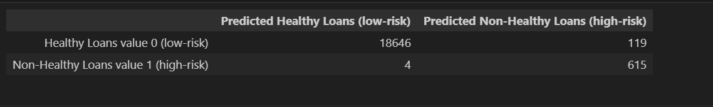
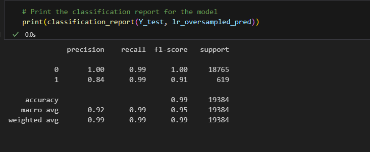
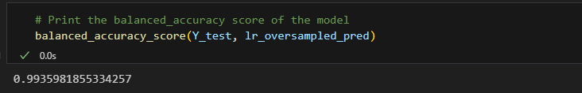

# Credit-Risk-Classification

 

## Table of Contents: 

1. [Overview of the Analysis](#overview-of-the-analysis)

2. [Basic Information about Variables](#basic-information-about-variables)

3. [Stages of Machine Learning Process](#stages-of-machine-learning-process)

4. [Method Used](#method-used)

5. [Model Results](#results)

6. [Summary](#summary)

 

## **Overview of the Analysis**

Lending companies face credit risk, which arises when borrowers fail to return assets or repay loans, resulting in financial loss. To assess creditworthiness, machine learning is employed to analyze historical lending data from a peer-to-peer lending service. This analysis aims to classify loans as healthy (low-risk) or non-healthy (high-risk) based on loan status.

The logistic regression model demonstrates strong predictive performance for both the '0' (healthy loan) and '1' (high-risk loan) labels. Here's a summary of its performance based on the provided confusion matrix and classification report:

#### Healthy Loans (Label '0'):
* Precision: The precision for healthy loans is 1.00, indicating that when the model predicts a loan as healthy, it is correct 100% of the time.
* Recall: The recall for healthy loans is 0.99, indicating that the model correctly identifies about 99% of all actual healthy loans.
* F1-score: The F1-score for healthy loans is 1.00, reflecting a perfect balance between precision and recall.

#### High-Risk Loans (Label '1'):
* Precision: The precision for high-risk loans is 0.84, meaning that when the model predicts a loan as high-risk, it is correct approximately 84% of the time.
* Recall: The recall for high-risk loans is 0.94, indicating that the model captures approximately 94% of all actual high-risk loans.
* F1-score: The F1-score for high-risk loans is 0.89, indicating a good balance between precision and recall.
These performance metrics suggest that the logistic regression model is highly effective in distinguishing between healthy and high-risk loans. It achieves near-perfect precision and recall for healthy loans, indicating very few false positives and negatives. Additionally, while there is a slightly lower precision for high-risk loans, the model still demonstrates strong performance in correctly identifying the majority of high-risk loans.
* The overall accuracy score of 0.9679 or 96.79% further confirms the model's excellent performance in predicting both classes.

The logistic regression model fitted with oversampled data demonstrates strong performance in predicting both the '0' (healthy loan) and '1' (high-risk loan) labels. Here's a breakdown of its predictive capabilities:

#### Healthy Loans (Label '0'):
* Precision: The precision for healthy loans is 1.00, indicating that when the model predicts a loan as healthy, it is correct 100% of the time.
* Recall: The recall for healthy loans is 0.99, indicating that the model correctly identifies about 99% of all actual healthy loans.
* F1-score: The F1-score for healthy loans is 1.00, reflecting a perfect balance between precision and recall.
* Support: The support for healthy loans is 18,765, indicating a substantial number of instances in this class.

#### High-Risk Loans (Label '1'):
* Precision: The precision for high-risk loans is 0.84, meaning that when the model predicts a loan as high-risk, it is correct approximately 84% of the time.
* Recall: The recall for high-risk loans is 0.99, indicating that the model captures approximately 99% of all actual high-risk loans.
* F1-score: The F1-score for high-risk loans is 0.91, representing a good balance between precision and recall.
* Support: The support for high-risk loans is 619, indicating a smaller but still significant number of instances in this class.
* The overall accuracy score of 0.9935 or 99% further confirms the model's excellent performance in predicting both classes.

Overall, the logistic regression model fitted with oversampled data performs exceptionally well in predicting healthy loans, achieving high precision, recall, and F1-score. It also demonstrates strong performance in identifying high-risk loans, with slightly lower precision but still excellent recall and F1-score. These results suggest that the model is effective in distinguishing between healthy and high-risk loans, making it valuable for risk assessment in lending scenarios.

#### In conclusion, the logistic regression model fitted with oversampled data shows exceptional predictive capability for both healthy and high-risk loans, making it valuable for risk assessment in lending scenarios.

 

## **Basic Information about Variables**

 

* The '0' (healthy loan) label had a large number of instances, with 18,765 occurrences.
* The '1' (high-risk loan) label had fewer instances, with 619 occurrences.

 

## **Stages-of-Machine-Learning-Process**

 

1. Problem Definition:
Clearly define the problem you're trying to solve and determine if it's suitable for a machine learning approach.
Define the goals and objectives of the project.

2. Data Collection:
Gather the relevant data needed to train and evaluate the machine learning model.
Ensure the data is representative, clean, and properly labeled (if applicable).

3. Data Preprocessing:
Clean the data by handling missing values, outliers, and errors.
Perform feature engineering to extract relevant features from the raw data.
Normalize or scale the features to ensure they have similar ranges.

4. Exploratory Data Analysis (EDA):
Explore and visualize the data to gain insights and understand its distribution, relationships, and patterns.
Identify correlations and potential biases in the data.

5. Model Selection:
Choose the appropriate machine learning algorithm(s) based on the problem type (e.g., classification, regression, clustering) and data characteristics.
Select the evaluation metrics to assess the performance of the models.

6. Model Training:
Split the data into training and validation/test sets.
Train the selected machine learning model(s) on the training data.
Optimize hyperparameters to improve model performance using techniques like cross-validation or grid search.

7. Model Evaluation:
Evaluate the trained models on the validation/test set using the selected evaluation metrics.
Compare the performance of different models and select the best-performing one.

8. Model Deployment:
Deploy the trained model into production or integrate it into the application/system where it will be used.
Monitor the model's performance and retrain/update it as needed to maintain accuracy over time.

9. Model Interpretation and Feedback:
Interpret the model's predictions and understand its decision-making process.
Gather feedback from users or stakeholders to improve the model or address any concerns.

10. Documentation and Reporting:
Document the entire machine learning process, including data collection, preprocessing steps, model selection, training, evaluation, and deployment.
Prepare reports or presentations to communicate the findings, insights, and recommendations to stakeholders.

## This model were using following steps:

1. Data Preprocessing: This involved splitting the data into training and testing sets.
2. Model Training: Various machine learning algorithms were trained on the Logistic Regression using original data and oversampled data to predict loan risk.
3. Model Evaluation: The models were evaluated using accuracy, precision, recall, and F1-score metrics to assess their performance.

## **Method Used**

* Logistic Regression Model with the Original Data (Used as a baseline model due to its simplicity and interpretability)
* Logistic Regression Model with the Resampled Traning Data

## Logistic Regression Model with the Original Data(imbalanced Data)

`Taking a look at the code in step 3 [Split the Data into Training and Testing Sets], using the value_counts function, we are able to see that the data is highly imbalanced. The majority class is healthy loans [0] and the minority class is non-healthy loans [1]:`

`According to the confusion matrix in step 3 [Create a LRM with Original Imbalanced Data]:`

* Out of the 18,765 loan status's that are healthy (low-risk), the model predicted 18,655 as 
   healthy correctly and 110 as healthy incorrectly. 

* Out of the 619 loan status's that are non-healthy (high-risk), the model 
   predicted 583 as non-healthy correctly and 36 as non-healthy incorrectly.

  * a healthy loan (low-risk) is classified as a non-healthy loan (high-risk).
  * a non-healthy loan (high-risk) is classified as a healthy loan (low-risk).

 

* Using the dataset provided by the lending company, I created a Logistic Regression Model that generated an accuracy score of 96%. Although the model generated a high-accuracy, the models recall value (0.94) for non-healthy loans is lower than the recall value (0.99) for healthy loans. This indicates that the model will predict loan status's as healthy better than being able to predict loan status's as non-healthy. This is due to the dataset being imbalanced, meaning that most of the data belongs to one class label (in this case healthy loans greatly outweighed non-healthy loans).

 

`The model generated an accuracy score of 96% but could be improved due to the dataset being imbalanced.`

 

## Logistic Regression Model with balanced Data(oversampled Data)

  * a healthy loan (low-risk) is classified as a non-healthy loan (high-risk).
  * a non-healthy loan (high-risk) is classified as a healthy loan (low-risk).

`To generate a higher accuracy score and have the model catch more mistakes when classifying non-healthy loans, we can oversample the data using the RandomOverSampler module from the imbalanced-learn library, which adds more copies of the minority class (non-healthy loans) to obtain a balanced dataset.`

* Out of the 619 loan status's that are non-healthy (high-risk), the model 
* predicted 615 as non-healthy correctly and 4 as non-healthy incorrectly.

`The model generated an accuracy score of 96% but could be improved due to the dataset being imbalanced.`

`The model generated an accuracy score of 99% due to the dataset being balanced.`

 

## **Results**

 

## Logistic Regression Model fitted with Imbalanced Data: 

 

* The Logistic Regression model fitted with the Imbalanced DataSet predicted healthy loans 100% of the time and predicted non-healthy loans 84% of the time.

* The model fitted with imbalanced data has a higher possibility of making these mistakes: 

 

## Logistic Regression Model fitted with balanced Data using  Resampled Traing Data

 

* Using the dataset provided by the lending company, I created a Logistic Regression Model fit with the oversampled data that generated an accuracy score of 99%, which turns out to be higher than the model fitted with imbalanced data. The oversampled model performs better due to the dataset being balanced. The models non-healthy loans recall value increased from 0.94 to 0.99 indicating that the model does an exceptional job in catching mistakes such as labeling non-healthy (high-risk) loans as healthy (low-risk).

 

## **Summary**

* A lending company might want a model that requires classifying healthy loans and non-healthy loans correctly most of the time: 

    * healthy loans being identified as a non-healthy loan might be more costly for a lending company since it might cause the loss of customers. 
  
    * non-healthy loans being identified as a healthy loan might also be more costly for a lending company due to the loss of funds being provided by the lender.

`The Logistic Regression model fitted with OverSampled data performed much better than the model fitted with Imbalanced data due to the data being balanced and generating a higher accuracy score and a higher recall, indicating that the model will make extremely fewer mistakes when classifying non-healthy loans.`

 

`The lending company would most likely want fewer False Positives due to the high possibility of a lender loosing provided funds when classifying non-healthy loans as healthy. The data below is shown in the confusion matrices which indicates how many healthy/non-healthy loans the model predicted correctly/incorrectly.`

* Model fitted with Imbalanced Data: 
  
  * 36 (FALSE POSITIVES) --> The actual value is healthy and the predicted value is non-healthy 

  * 110 (FALSE NEGATIVES) --> The actual value is non-healthy and the predicted value is healthy

 

* Model fitted with Balanced Data: 
  
  * 4 (FALSE POSITIVES) --> The actual value is healthy and the predicted value is non-healthy 

  * 119 (FALSE NEGATIVES) --> The actual value is non-healthy and the predicted value is healthy
  
`According to the confusion matrices, the number of False Postives drastically decreases indicating the model will classify healthy & non-healthy loans correctly. Based off of this analysis, I would recommend using Model 2 (Logistic Regression Model fitted with Balanced (oversampled) data.`

